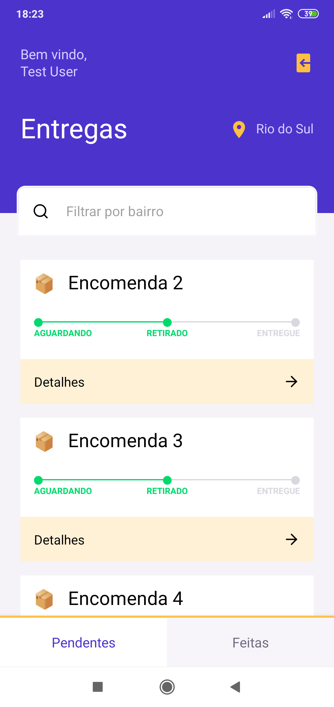

<h1 align="center">
    FastFeet
</h1>

# Sobre o projeto

Trata-se de uma aplicação para uma transportadora fictícia. A versão mobile representa a visão do entregador.
Backend da aplicação foi desenvolvido utilizando arquitetura limpa.

# Layout

<table>
    <tr>
        <td>
            
        </td>
        <td>
            
        </td>
    </tr>
    <tr>
        <td>
            
        </td>
        <td>
            
        </td>
    </tr>
</table>

# Funcionalidades

- Autenticação de usuários ( entregadores e admin )
- Gestão de usuários (criar / atualizar)
- Gestão de encomendas ( criar / atualizar )
- Visualizar encomendas
- Iniciar entrega
- Finalizar entrega (enviando foto da assinatura do destinatário)

# Tecnologias

## Mobile

- React Native
- TypeScript
- StyledComponents
- Axios

## Server

- Node.js
- TypeScript
- Express
- TypeORM
- BCrypt
- JWT
- Multer
- Winston

# Licença

Esse projeto está sob a licença MIT.
